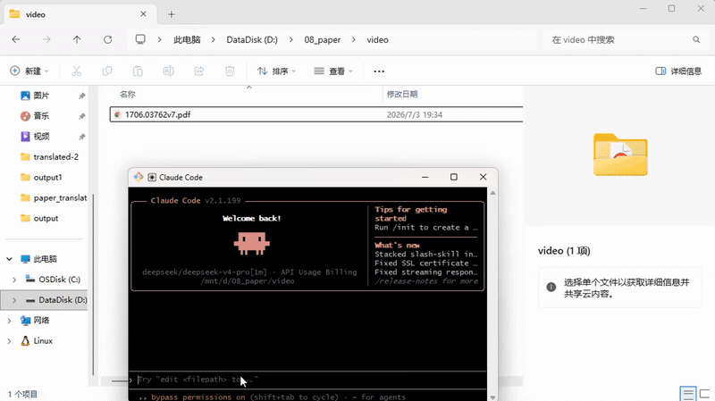

# pdf-translate

> Claude Code 技能：一键将英文论文 PDF 翻译为中文，保留公式、图表、目录和页面排版。

[](https://opensource.org/licenses/MIT)

**pdf-translate** 是一个 [Claude Code](https://claude.ai/code) 技能，封装了 [PDFMathTranslate-next](https://github.com/reycn/pdf2zh-next)（基于 [BabelDOC](https://github.com/fky2015/babeldoc)），让你在 Claude Code 中只需一句话即可完成论文翻译。每次翻译生成两个文件：

- **`*-mono.pdf`** — 中文单语版（仅译文）
- **`*-dual.pdf`** — 双语对照版（原文 + 译文并列）

---

## 演示

在 Claude Code 中使用 pdf-translate 翻译论文的完整流程演示：



> 🎬 [点击这里观看高清 MP4 视频](https://github.com/L27z18328742/pdf-translate/releases/download/demo-v1/github_video.mp4)（含完整清晰画面）。

---

## 前置要求

本技能依赖 **[uv](https://docs.astral.sh/uv/)**（Python 包管理器）来安装 `pdf2zh_next`。请先安装 uv：

### Linux / macOS

```bash
curl -LsSf https://astral.sh/uv/install.sh | sh
```

安装后，确保 `~/.local/bin` 在 PATH 中：

```bash
export PATH="$HOME/.local/bin:$PATH"
```

将上面这行添加到 `~/.bashrc` 或 `~/.zshrc` 以永久生效。

### Windows (PowerShell)

```powershell
powershell -ExecutionPolicy ByPass -c "irm https://astral.sh/uv/install.ps1 | iex"
```

### 验证安装

```bash
uv --version
# 应输出版本号，例如 uv 0.7.x
```

> **💡 uv 是什么？** uv 是 Astral 开发的极速 Python 包管理器（用 Rust 编写），比 pip 快 10-100 倍。本技能用它来隔离安装 `pdf2zh_next`，不会污染你的系统 Python 环境。

---

## 快速开始

在 Claude Code 中，直接说：

```
翻译 /path/to/paper.pdf
```

Claude Code 会自动调用本技能，完成环境安装和翻译。

或者手动执行脚本：

```bash
# 第一步：安装 pdf2zh_next（仅需一次）
bash ~/.claude/skills/pdf-translate/scripts/setup.sh

# 第二步：翻译论文
bash ~/.claude/skills/pdf-translate/scripts/translate.sh "paper.pdf"
```

> ⏳ **首次运行提示**：第一次翻译时会自动下载 DocLayout-YOLO 模型和字体资源（约数百 MB），之后的翻译会直接使用缓存，速度很快。

---

## 翻译引擎

脚本会自动选择最佳引擎，也支持手动指定：

| 引擎 | 触发条件 | 特点 |
|------|---------|------|
| **ClaudeCode** | `claude` CLI 可用（Claude Code 环境） | 使用 Claude 模型翻译，质量高；每段文本启动一个子进程，相对较慢 |
| **OpenAI 兼容** | 检测到 `OPENAI_API_KEY` | HTTP API，高并发，速度快；自动复用 Codex 配置 |
| **SiliconFlowFree** | 无任何 API 密钥 | 免费 GLM-4-9B 服务，零配置，无需密钥 |

手动指定引擎：

```bash
translate.sh paper.pdf --engine openai --model gpt-4o-mini
translate.sh paper.pdf --engine siliconflowfree
translate.sh paper.pdf --engine claudecode --model sonnet
```

---

## 常用选项

| 选项 | 说明 | 示例 |
|------|------|------|
| `--output <dir>` | 输出目录 | `--output ./translated` |
| `--pages "1-5,8"` | 仅翻译指定页 | `--pages "1-10"` |
| `--lang-in / --lang-out` | 源语言/目标语言 | `--lang-in en --lang-out zh-CN` |
| `--no-dual` / `--no-mono` | 跳过双语版/单语版 | `--no-dual` |
| `--qps N` | 每秒请求数限制 | `--qps 20` |
| `--pool-max-workers N` | 并发工作数 | `--pool-max-workers 50` |
| `--model <name>` | 指定模型 | `--model gpt-4o` |
| `--base-url <url>` | API 地址 (OpenAI 引擎) | `--base-url https://api.openai.com/v1` |
| `-- <flag> <value>` | 透传任意 pdf2zh_next 参数 | `-- --glossaries terms.csv` |

完整选项说明见 [`references/advanced.md`](references/advanced.md)。

---

## 支持的语言

默认方向为 **英语 → 简体中文**，也支持其他语言：

| 语言 | 代码 |
|------|------|
| 英语 | `en` |
| 简体中文 | `zh-CN` |
| 繁体中文 | `zh-TW` |
| 日语 | `ja` |
| 韩语 | `ko` |
| 法语 | `fr` |
| 德语 | `de` |
| 西班牙语 | `es` |
| 俄语 | `ru` |

```bash
# 日语 → 中文
translate.sh paper.pdf --lang-in ja --lang-out zh-CN

# 中文 → 英语
translate.sh paper.pdf --lang-in zh-CN --lang-out en
```

---

## 常见问题

| 问题 | 解决方案 |
|------|---------|
| `command not found: pdf2zh_next` | 运行 `setup.sh`，确保 `~/.local/bin` 在 PATH 中 |
| 首次翻译很慢 | 正常：正在下载模型资源（仅一次） |
| 429 速率限制错误 | 降低 `--qps` 和 `--pool-max-workers` |
| OpenAI 引擎报 404/400 | 网关可能不支持 `/chat/completions`，换用 `--engine siliconflowfree` |
| 内存不足 / PDF 很大 | 用 `--pages` 分段翻译 |

更多故障排除见 [`references/advanced.md`](references/advanced.md)。

---

## 致谢

本项目站在以下优秀开源项目的肩膀之上：

- **[PDFMathTranslate](https://github.com/Byaidu/PDFMathTranslate)** — 开创性的 PDF 科学论文翻译工具，完美保留公式、图表和排版。由 [@Byaidu](https://github.com/Byaidu) 和社区贡献者创建。
- **[BabelDOC](https://github.com/fky2015/babeldoc)** — 新一代 PDF 文档解析与翻译框架，提供高质量的中间表示（IL）和排版引擎。由 [@fky2015](https://github.com/fky2015) 开发。
- **[PDFMathTranslate-next](https://github.com/reycn/pdf2zh-next)** — 基于 BabelDOC 的 pdf2zh 下一代实现，支持多种 LLM 翻译引擎。由 [@reycn](https://github.com/reycn) 开发和维护。
- **[DocLayout-YOLO](https://github.com/opendatalab/DocLayout-YOLO)** — 高精度文档布局检测模型，为 PDF 解析提供精准的段落、公式、图表区域识别。
- **[Claude Code](https://claude.ai/code)** — Anthropic 的 AI 编程助手，本技能的运行平台。
- **[uv](https://github.com/astral-sh/uv)** — Astral 开发的极速 Python 包管理器，让环境安装变得简单可靠。
- **[LINUX DO](https://linux.do)** — 真诚、友善、团结、专业，共建你我引以为荣之社区。

---

## 许可证

MIT License

---

<p align="center">
  <sub>Made with ❤️ for the research community</sub>
</p>
